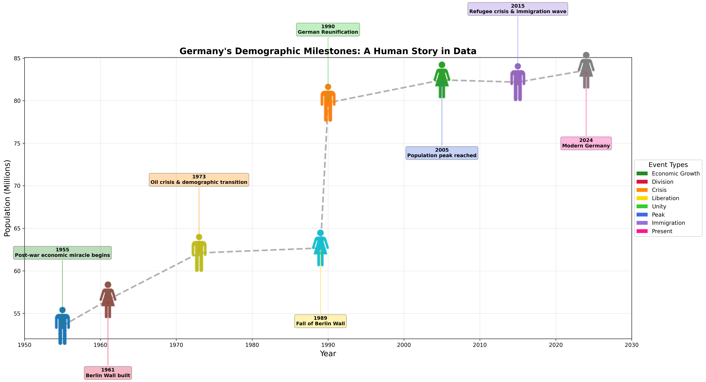
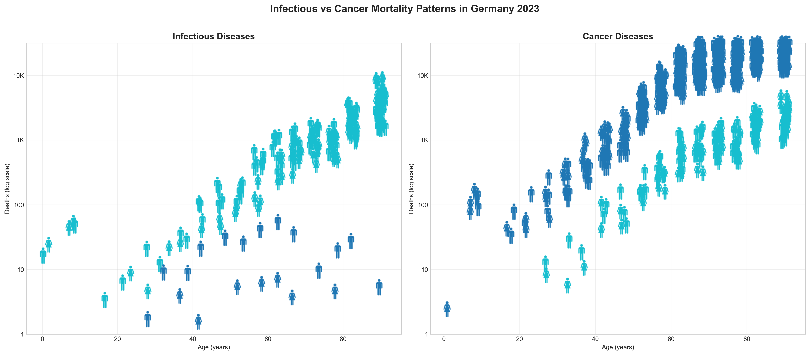

# Demoviz - demographic visualization

> **note**
> Fell free to fork or use it as a template for your own project with other icons.

## Installation
``` bash
pip install demoviz
```

## Demoviz

Demoviz is a library for creating demographic visualizations.
Using human vector icons, it can create scatter plots of demographic data, coloring the icons by the demographic data.
and highlight the icons by the demographic data.

# Acknowledgments
the icons have been retrieved from wikimedia commons.
``` bash
# female icon
wget https://upload.wikimedia.org/wikipedia/commons/f/f9/Woman_%28958542%29_-_The_Noun_Project.svg
# male icon
wget https://upload.wikimedia.org/wikipedia/commons/d/d8/Person_icon_BLACK-01.svg
```

## Example
See readme in example directory for more details, but her in short:
``` bash
cd example  
python demographic_change.py
python disease_analysis.py
```
The data displayed is from 2023 and beatifully visualized the fall of the berlin wall and the reunification of germany.


But also the disease burden and the sex-specific disease burden are visualized.


Baby icons are also available for pediatric and child health visualizations.
``` bash
wget https://upload.wikimedia.org/wikipedia/commons/9/9d/Baby_%2875158%29_-_The_Noun_Project.svg
```

### Baby Icon Example
``` python
import numpy as np
import matplotlib.pyplot as plt
from demoviz import DemoScatter

# Create sample baby health data
ages = [0, 6, 12, 18, 24]  # Age in months
weights = [3.5, 7.0, 9.5, 11.0, 12.5]  # Weight in kg

# Create the plot
fig, ax = plt.subplots(figsize=(8, 6))

# Initialize DemoScatter with baby icons
demo = DemoScatter(icon_size=40, zoom=0.4)

# Plot babies with baby icons
demo.plot(ax, ages, weights, icon_type='baby', colors='lightblue')

# Customize the plot
ax.set_xlabel('Age (months)')
ax.set_ylabel('Weight (kg)')
ax.set_title('Baby Growth Chart')
ax.grid(True, alpha=0.3)

plt.tight_layout()
plt.show()
```

Available icon types: `'baby'`, `'child'`, `'infant'`, `'male'`, `'female'`, `'person'`

In any case, if you ever need to plot some human icons or icons in general, you can use the `demoviz` library.

## Demoviz

Demoviz is a library for creating demographic visualizations.
