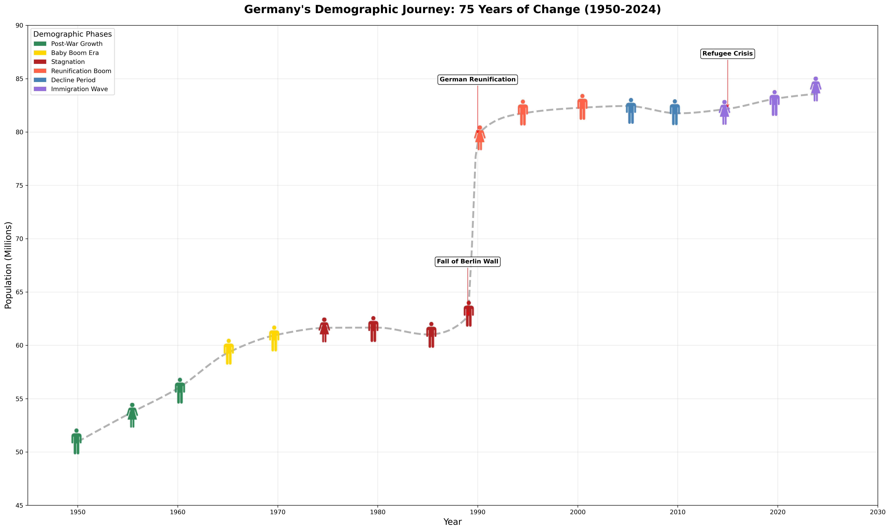

# Demoviz - demographic visualization

> **note**
> Feel free to fork or use it as a template for your own project with other icons.

## Installation
``` bash
pip install demoviz
```

## Demoviz

Demoviz is a library for creating demographic visualizations.
Using human vector icons, it can create scatter plots of demographic data, coloring the icons by the demographic data
and highlighting the icons by the demographic data.

# Acknowledgments
The icons have been retrieved from Wikimedia Commons.
``` bash
# female icon
wget https://upload.wikimedia.org/wikipedia/commons/f/f9/Woman_%28958542%29_-_The_Noun_Project.svg
# male icon
wget https://upload.wikimedia.org/wikipedia/commons/d/d8/Person_icon_BLACK-01.svg
```

## Example
See readme in example directory for more details, but here in short:
``` bash
cd example  
python demographic_change.py
python disease_analysis.py
```
The data displayed is from 2023 and beautifully visualizes the fall of the Berlin Wall and the reunification of Germany.



Baby icons are also available.
``` bash
wget https://upload.wikimedia.org/wikipedia/commons/9/9d/Baby_%2875158%29_-_The_Noun_Project.svg
```

In any case, if you ever need to plot some human icons or icons in general, you can use the `demoviz` library.

## Demoviz

Demoviz is a library for creating demographic visualizations.
